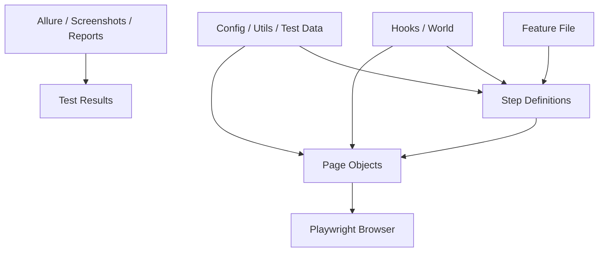

# Framework Architecture

## 1. Overview
This repository implements a Behavior-Driven Development (BDD) automation framework using:
- Cucumber for scenario-driven test execution
- Playwright for browser automation
- TypeScript for type-safe test code
- Page Object Model (POM) for UI interaction abstraction

The framework is structured to separate test scenarios, step definitions, page interactions, and test support utilities.

## 2. Architecture Style
The current design follows a layered architecture:

1. Feature Layer
   - Stores business-readable scenarios in Gherkin
2. Step Definition Layer
   - Maps Gherkin steps to automation actions
3. Page Object Layer
   - Encapsulates locators and UI actions
4. Support Layer
   - Handles browser setup, world context, logging, data generation, and reporting

## 3. Execution Flow

## 4. Folder Structure and Responsibilities

### Root files
- package.json
  - Project dependencies and scripts
- playwright.config.ts
  - Playwright configuration for browser projects and reporting
- cucumber.js
  - Cucumber runtime configuration and step/hook loading
- tsconfig.json
  - TypeScript compiler settings

### config/
- config.ts
  - Central base URL configuration for the application under test

### features/
- Contains BDD scenarios written in Gherkin
- Examples:
  - login.feature
  - products.feature
  - home.feature

### stepDefinitions/
- Implements the behavior described in feature files
- Uses Cucumber annotations such as Given, When, Then
- Files include:
  - login.steps.ts
  - products.step.ts
  - homePage.spec.ts
  - common.steps.ts
  - signup.steps.ts

### pages/
- Holds page object classes that abstract UI interactions
- Each page class contains:
  - locators
  - actions like click, fill, verify text
- Files include:
  - LoginPage.ts
  - HomePage.ts
  - productsPage.ts
  - signupPage.ts

### hooks/
- Contains global lifecycle logic for the test framework
- world.ts
  - Defines the custom Cucumber world object shared across steps
- hooks.ts
  - Handles browser initialization, cleanup, screenshots, and reporting attachment

### utils/
- Shared helper modules
- Logger.ts
  - Provides consistent logging
- TestDataGenerator.ts
  - Generates test data using Faker

### tests/
- Contains Playwright-native test examples
- example.spec.ts
  - Demonstrates a basic Playwright test outside the Cucumber flow

### reports/, screenshots/, allure-results/, allure-report/
- Generated artifacts for reports, screenshots, and Allure output

## 5. Core Design Pattern

### Page Object Model (POM)
Each page is represented by a class. This keeps the UI selectors and actions in one place, making tests easier to maintain.

Example flow:
- Step definition calls a method from a page object
- Page object performs the interaction using Playwright locators
- Assertions are done in step definitions or page object methods

### Cucumber World
The custom world object stores shared state such as:
- page
- browser context
- page object instances
- test data generated during a scenario

This allows step definitions to share context without relying on global variables.

### Hooks
Hooks manage the lifecycle of each scenario:
- start browser before scenario
- close browser after scenario
- collect test data for reporting
- capture screenshots on failure

## 6. Current Test Flow Example
A typical login scenario follows this path:
1. Feature file provides the scenario steps
2. Cucumber executes the matching step definitions
3. Step definitions call methods on LoginPage
4. LoginPage interacts with the UI through Playwright locators
5. Assertions verify the expected outcome
6. Hooks clean up the browser and attach reporting artifacts

## 7. Strengths of the Current Framework
- Clear separation between tests and UI logic
- Reusable page object structure
- Dynamic test data generation
- Browser lifecycle management through hooks
- Failure screenshots and Allure reporting support

## 8. Improvement Opportunities
- Standardize naming across files and step definitions
- Remove unused imports and legacy code
- Consolidate duplicate page object logic where possible
- Use a consistent browser strategy between Playwright config and Cucumber hooks
- Add more reusable helper methods for waits and assertions

## 9. Suggested Architecture Direction
For future growth, this framework can evolve into a more scalable structure by introducing:
- a shared base page class
- a central assertion helper
- environment-based configuration for multiple test environments
- data-driven test data files
- richer reporting and test tagging strategy
